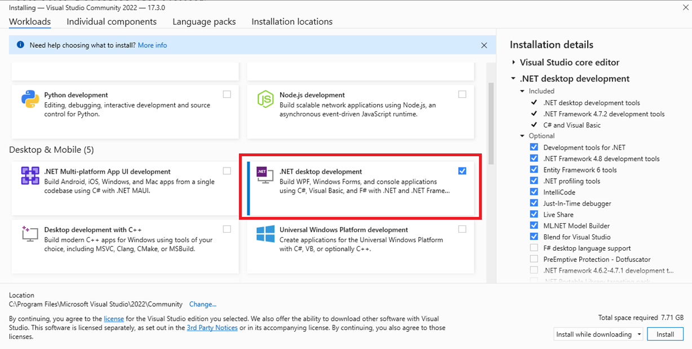
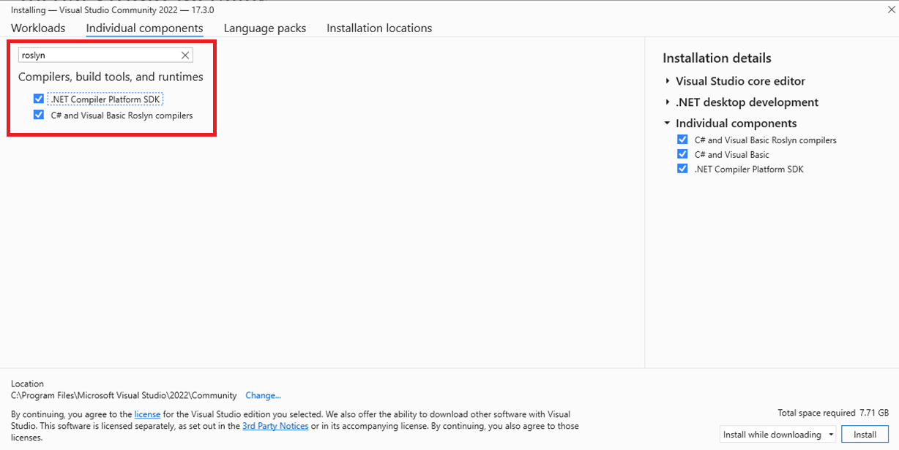
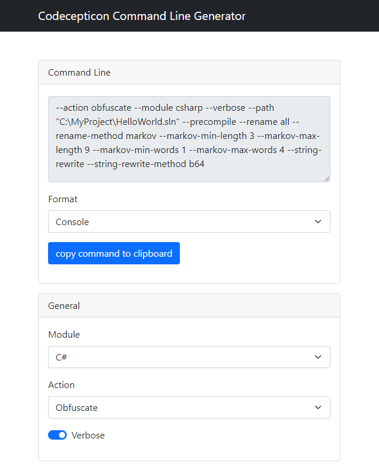
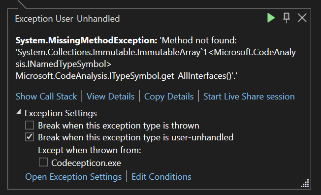

# Codecepticon

## Table of Contents

* [Introduction](#introduction)
* [Read This First](#read-this-first)
* [Prerequisites](#prerequisites)
    * [Visual Studio](#visual-studio-procommunity-2022)
    * [Roslyn Compiler](#roslyn-compiler)
    * [Check to see if it works](#open-and-compile)
* [Using Codecepticon](#using-codecepticon)
    * [C#](#c)
    * [VBA/VB6](#vbavb6)
    * [PowerShell](#powershell)
    * [Obfuscating Command Line Arguments](#obfuscating-command-line-arguments)
    * [Functionality Deep Dive](docs/Functionality.md)
    * [Tips](docs/Tips.md)
    * [Known Issues](docs/KnownIssues.md)
* [FAQ](#faq)
* [Troubleshooting](#troubleshooting)
* [Contributions](#contributions)
* [References / Credits](#references--credits)

## Introduction

Codecepticon is a .NET application that allows you to obfuscate C#, VBA/VB6 (macros), and PowerShell source code, and is developed for offensive security engagements such as Red/Purple Teams. What separates Codecepticon from other obfuscators is that it targets the source code rather than the compiled executables, and was developed specifically for AV/EDR evasion.

Codecepticon allows you to obfuscate and rewrite code, but also provides features such as rewriting the command line as well.

## Read This First

<span style="color: red">!</span> Before we begin <span style="color: red">!</span>

* This documentation is on how to install and use Codecepticon only. Compilation, usage, and support for tools like Rubeus and SharpHound will not be provided. Refer to each project's repo separately for more information.
* Codecepticon is actively developed/tested in VS2022, but it _should_ work in VS2019 as well. Any tickets/issues created for VS2019 and below, will not be investigated unless the issue is reproducible in VS2022. So please use the latest and greatest VS2022.
* The following packages **MUST be v3.9.0**, as newer versions have the following issue which is still open: https://github.com/dotnet/roslyn/issues/58463
    * Microsoft.CodeAnalysis.CSharp.Workspaces
    * Microsoft.CodeAnalysis.Workspaces.MSBuild
    
    Codecepticon checks the version of these packages on runtime and will inform you if the version is different to v3.9.0.
* It cannot be stressed this enough: **always test your obfuscated code locally first**.

## Prerequisites

### Visual Studio Pro/Community 2022



### Roslyn Compiler



### Open and Compile

Open Codecepticon, wait until all NuGet packages are downloaded and then build the solution.

## Using Codecepticon

There are two ways to use Codecepticon, either by putting all arguments in the command line or by passing a single XML configuration file. Due to the high level of supported customisations, It's not recommended manually going through `--help` output to try and figure out which parameters to use and how. Use [CommandLineGenerator.html](CommandLineGenerator.html) and generate your command quickly:



The command generator's output format can be either `Console` or `XML`, depending what you prefer. Console commands can be executed as:

```
Codecepticon.exe --action obfuscate --module csharp --verbose ...etc
```

While when using an XML config file, as:

```
Codecepticon.exe --config C:\Your\Path\To\The\File.xml
```

If you want to deep dive into Codecepticon's functionality, [check out this document](docs/Functionality.md).

For tips you can use, [check out this document](docs/Tips.md).

### C#

Obfuscating a C# project is simple, simply select the solution you wish to target. Note that a backup of the solution itself will not be taken, and the current one will be the one that will be obfuscated. Make sure that you can independently compile the target project before trying to run Codecepticon against it.

### VBA/VB6

The VBA obfuscation works against source code itself rather than a Microsoft Office document. This means that you cannot pass a `doc(x)` or `xls(x)` file to Codecepticon. It will have to be the source code of the module itself (press Alt-F11 and copy the code from there).

### PowerShell

Due to the complexity of PowerShell scripts, along with the freedom it provides in how to write scripts it is challenging to cover all edge cases and ensure that the obfuscated result will be fully functional. Although it's expected for Codecepticon to work fine against simple scripts/functionality, running it against complex ones such as PowerView will not work - this is a work in progress.

### Obfuscating Command Line Arguments

After obfuscating an application or a script, it is very likely that the command line arguments have also been renamed. The solution to this is to use the HTML mapping file to find what the new names are. For example, let's convert the following command line:

```
SharpHound.exe --CollectionMethods DCOnly --OutputDirectory C:\temp\
```

By searching through the HTML mapping file for each argument, we get:


And by replacing all strings the result is:

```
ObfuscatedSharpHound.exe --AphylesPiansAsp TurthsTance --AnineWondon C:\temp\
```

However, some values may exist in more than one category:


Therefore it is **critical** to always test your result in a local environment first.

## FAQ

### Why isn't there a compiled version under Releases that I can download?
The compiled output includes a lot of dependency DLLs, which due to licensing requirements we can't re-distribute without written consent.

### Does Codecepticon only work for C# projects that already have a supported profile?
No, Codecepticon should work with everything. The profiles are just a bit of extra tweaks that are done to the target project in order to make it more reliable and easier to work with.

But as all code is unique, there will be instances where obfuscating a project will end up with an error or two that won't allow it to be compiled or executed. In this case a new profile may be in order - please raise a new issue if this is the case.

Same principle applies to PowerShell/VBA code - although those currently have no profiles that come with Codecepticon, it's an easy task to add if some are needed.

### Can I contribute?
For reporting bugs and suggesting new features, please create an issue.

For submitting pull requests, please see the [Contributions](#contributions) section.

## Troubleshooting

### I'm using Codecepticon against a C# project, it runs, but afterwards I can't compile the target project.
Before running Codecepticon make sure you can compile a **clean** version of the target project. Very often when this issue appears, it's due to missing dependencies for the target solution rather than Codecepticon. But if it still doesn't compile:

* Is it a public project? Create an issue and paste the link with as much detail as possible. If the tool is part of SharpCollection, even better.
* Is it a private project? In the spirit of improving Codecepticon we'll try to provide as much support as possible via screenshots and error/debug messages. But we will not be accessing/running any clean/obfuscated code via private repos etc.

### Same as above, but it's a PowerShell/VBA script - can you help?
I will do my best, but as PowerShell scripts can be VERY complex and the PSParser isn't as advanced as Roslyn for C#, no promises can be made. Same applies for VBA/VB6.

### I keep getting: "Method not found: 'System.Collections.Immutable.ImmutableArray"
You may at some point encounter the following error:



Still trying to get to the bottom of this one, a quick fix is to uninstall and reinstall the `System.Collections.Immutable` package, from the NuGet Package Manager.

## Contributions
Whether it's a typo, a bug, or a new feature, Codecepticon is very open to contributions as long as we agree on the following:
* You are OK with the MIT license of this project.
* Before creating a pull request, create an issue so it could be discussed before doing any work as internal development is not tracked via the public GitHub repository. Otherwise you risk having a pull request rejected if for example we are already working on the same/similar feature, or for any other reason.

## References / Credits

* https://blog.xpnsec.com/building-modifying-packing-devops/
* https://twitter.com/EmericNasi/status/1460640760928296966
* https://github.com/MagicMau/ProceduralNameGenerator
* https://github.com/uwol/proleap-vb6-parser
* https://github.com/dwyl/english-words
